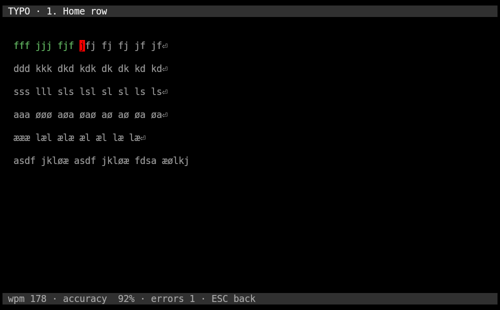

# typo



**The terminal touch-typing tutor. Written in Rust.**

   

Strict touch-typing tutor for the terminal. Eight lessons take you from the home row to full sentences. Built on [Crust](https://github.com/isene/crust), part of the [Fe2O3 suite](https://github.com/isene/fe2o3).



## Features

- **Eight lessons**: home row, top row, bottom row, capitals, numbers, symbols, sentences
- **Two keyboard layouts**: US and Norwegian, with layout-specific drills (æ ø å, Norwegian shift pairings)
- **Strict mode**: the drill only advances on the correct key; wrong keys count as errors and flash red
- **Live stats**: WPM, accuracy, and error count in the status bar, updated per keypress
- **Personal bests**: tracked per lesson per layout, shown in the menu
- **Zero idle cost**: fully event-driven, no timers, no polling
- **Single binary**: one dependency (crust), instant startup

## Install

Download the prebuilt binary from [Releases](https://github.com/isene/typo/releases), or build from source:

```bash
cargo build --release
cp target/release/typo ~/.local/bin/
```

## Key Bindings

| Key | Action |
|-----|--------|
| j/k, UP/DOWN | Select lesson |
| 1-8 | Jump straight into a lesson |
| ENTER | Start selected lesson |
| l | Toggle keyboard layout (US / Norwegian) |
| q, ESC | Quit |

In a drill: type what you see. `⏎` means press ENTER. `ESC` returns to the menu. After a result, `r` retries the lesson.

## Layouts

The tutor checks the character you produce, so any keyboard works. The lessons themselves are layout-specific: the Norwegian set puts ø and æ on the home row, å with the top row, and drills the Norwegian shift pairings (`s"`, `f¤`, `j/`, `ø=`). The layout choice persists across sessions.

## Files

`~/.typo` holds the chosen layout and your personal bests. Plain tab-separated text; delete a line to reset that best.

## License

Public domain (Unlicense). Created by [Geir Isene](https://isene.com).
